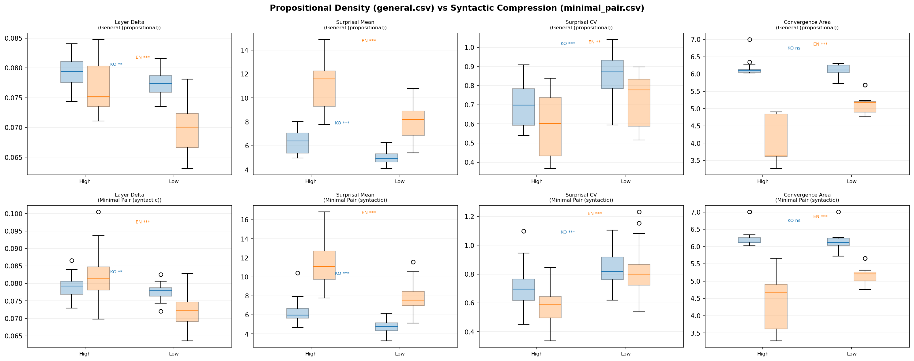
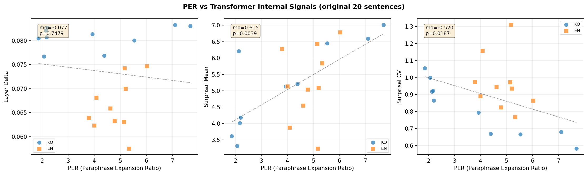

## Same 20 Tokens, Different Universes

Consider two sentences:

> "It is fortunate enough if a revolution does not turn its worst enemies into its new masters."
> --- Jakob Burckhardt

> "This morning I woke up early, washed my face with warm water, ate breakfast, and then went to school."

The token counts are comparable. But if you try to rewrite the first sentence so a fifth-grader can fully understand it --- spelling out every implied premise, every compressed argument --- the expanded version is over **7 times** longer. The second sentence barely grows at all.

I call this difference **density**. The same container, but wildly different amounts of content inside. And crucially, this is not about difficult vocabulary. "Quantum non-locality" is hard, but it carries only one proposition. It is not dense. Density is compression.

The Korean version of the Burckhardt quote ("혁명이 숙적을 주인으로 만들지 않는다면 그것만으로도 행운이다") demonstrates this even more dramatically --- the agglutinative structure of Korean packs multiple relational clauses into a remarkably tight surface form.

So the question became: **do transformer models "feel" this difference?**

---

## PER: How Much Longer When You Unpack It?

There are plenty of existing ways to measure text complexity. Perplexity tells you how well a model predicts the next token. But it cannot distinguish between "hard words" and "dense meaning." A sentence full of rare medical jargon will score high on perplexity, but it might carry only a single proposition.

I created a new metric: **PER (Paraphrase Expansion Ratio)**.

The idea is simple. Ask an LLM to rewrite the original sentence "so that an elementary school student can understand it, making all implicit content explicit." Then measure the ratio:

$$\text{PER}(s) = \frac{|\text{tokens}(\text{paraphrase}(s))|}{|\text{tokens}(s)|}$$

For a sentence $s$, PER is the token count of the LLM-generated expansion divided by the original token count. PER > 1 means the sentence gets longer when unpacked; the higher the value, the more compressed the original was.

The Burckhardt sentence: **PER = 7.70**. The daily routine sentence: **PER = 1.70**. Same token count, but **4.5x difference in information content**.

Here is how PER compares to existing metrics:

| Metric | Definition | Limitation |
|---|---|---|
| Perplexity | $\text{PPL} = \exp\!\bigl(-\frac{1}{N}\sum_{i=1}^{N}\log P(t_i \mid t_{<i})\bigr)$ | Hard vocabulary also scores high --- conflates difficulty with density |
| Propositional Density | verb/adj/conjunction count / total words | Structural measurement --- misses implicit propositions |
| **PER** | $\|\text{tokens}(\text{paraphrase})\| / \|\text{tokens}(\text{original})\|$ | Semantic measurement --- "how much speech is needed for full understanding?" |


*Figure 1: PER comparison across 6 LLMs. Korean high-density sentences (red) consistently show the highest PER.*

But wait --- if the measuring instrument is itself an LLM, won't different LLMs give different answers?

---

## Six LLMs Paraphrase the Same Sentences

Claude Opus 4.6, Claude Sonnet 4.6, GPT-5.4-pro, GPT-5.4-thinking, Gemini Flash, and Gemini 3.1 Pro.

Twenty sentences: 5 high-density and 5 low-density in Korean, the same in English.

The result: **two distinct clusters emerged**.

| Cluster | Models | Inter-model Spearman $\rho$ |
|---|---|---|
| **GPT + Claude** | 4 models | 0.74 -- 0.88 *** |
| **Gemini** | 2 models | 0.54 * |
| Between clusters | --- | -0.14 -- 0.19 (n.s.) |

GPT and Claude **agree** on which sentences are denser. But Gemini ranks them in a completely different order. The cross-cluster correlations are essentially zero.

This is not an error. It reveals something deeper: the LLM itself is the density-measuring instrument, and different LLMs define density differently. "Density" may not be a purely objective property --- it depends on the interpreter.

One finding I did not expect: **Korean high-density sentences were the most stable across all models**. The top 5 most consistently rated sentences (CV = 0.27--0.28 across all 6 LLMs) were all Korean. Every model agreed: "these are definitely dense." English was messier --- sentences we had labeled "low-density" turned out to carry more hidden content than anticipated (implicit cultural context, procedural assumptions), and model agreement broke down.

The practical lesson: **PER should be used as a relative ranking, not an absolute value.** "This sentence is denser than that one" is meaningful. "This sentence has a PER of 5.3" is model-dependent.


*Figure 2: Spearman rank correlation matrix between LLMs. GPT+Claude cluster vs Gemini cluster.*

---

## What Happens Inside the Model?

Suppose PER measures density. The next question: when a transformer processes these sentences, **does something measurably different happen internally?**

I measured five internal signals. Here are their mathematical definitions.

### 1. Attention Entropy

For attention distribution $\mathbf{a}$ at query position $i$, head $h$, layer $l$:

$$H(\mathbf{a}_{l,h,i}) = -\sum_{j=1}^{S} a_{l,h,i,j} \log_2 a_{l,h,i,j}$$

High entropy means attention is spread across many tokens. Sentence-level values are averaged over all heads and positions.

### 2. Hidden State Norm

For hidden state $\mathbf{h}_l \in \mathbb{R}^{S \times D}$ at layer $l$:

$$\|\mathbf{h}_l\| = \frac{1}{S}\sum_{i=1}^{S} \|\mathbf{h}_{l,i}\|_2$$

### 3. Layer Delta

The representational change between consecutive layers:

$$\delta_l = 1 - \frac{\bar{\mathbf{h}}_l \cdot \bar{\mathbf{h}}_{l-1}}{\|\bar{\mathbf{h}}_l\| \|\bar{\mathbf{h}}_{l-1}\|}$$

where $\bar{\mathbf{h}}_l$ is mean-pooled over the token dimension. $\delta_l = 0$ means the representations are identical; $\delta_l = 1$ means they are orthogonal. The intuition: a large delta at layer $l$ means that layer performed a lot of "work" --- a significant transformation of the representation.

### 4. Effective Rank

Given the SVD of hidden states $\mathbf{h}_l = U \Sigma V^T$, normalizing singular values $\sigma_1, \ldots, \sigma_k$ into a probability distribution $p_i = \sigma_i / \sum_j \sigma_j$:

$$\text{erank}(\mathbf{h}_l) = \exp\!\Bigl(-\sum_{i} p_i \log p_i\Bigr)$$

This is the exponential of the Shannon entropy --- it measures how many "effective" dimensions the representation uses. More complex content should require more dimensions.

### 5. Attention Distance

Attention-weighted position distance:

$$d_{l,h,i} = \sum_{j=1}^{S} a_{l,h,i,j} \cdot |i - j|$$

Higher values mean attention reaches to more distant tokens --- an indicator of long-range dependency.

I ran experiments with four models:
- `klue/bert-base` --- Korean-specialized encoder
- `bert-base-uncased` --- English encoder
- `gpt2` --- English decoder (baseline)
- `Qwen3-0.6B` --- Korean/English multilingual modern decoder

---

## First Lesson: Failure Teaches More

I have to be honest about the initial attempt. The first version of this experiment used mBERT (multilingual BERT) and GPT-2.

**Result: nothing.** All 5 signals, both models, every comparison p > 0.05. Complete null.

Why? GPT-2 is English-only. Feeding it Korean text like "혁명이 숙적을 주인으로..." is meaningless --- to GPT-2, that is just a sequence of bytes with no semantic structure. mBERT handles Korean, but it is not specialized enough to capture density-level distinctions.

**Switching to language-matched models changed everything.** The moment I used `klue/bert-base` (a Korean-specific BERT), signals appeared.

---

## Pilot Results: Layer Delta Breaks Through

With the language-matched models and our original 20-sentence pilot set (5 high-density, 5 low-density per language):

```
klue/bert-base (Korean Encoder)
  Layer Delta    High > Low    p = 0.032 *
  (All other 4 signals: n.s.)
```

Dense sentences produce **larger representational changes** between layers. The intuition checks out: to "unpack" compressed meaning, each layer needs to do more transformational work.


*Figure 3: Layer-wise internal signals from klue/bert-base on Korean sentences (red=high density, blue=low density).*

And then came the twist.

### Encoder and Decoder Process Density in Opposite Directions

Qwen3-0.6B (decoder) also showed a Layer Delta trend --- but the **direction was reversed**.

```
klue/bert-base  (encoder):  Layer Delta  High > Low   p = 0.032 *
Qwen3-0.6B      (decoder):  Layer Delta  High < Low   p = 0.076 (marginal)
```

In the encoder, high density leads to larger changes. In the decoder, high density leads to *smaller* changes. Same sentences, same signal, opposite directions depending on architecture.

Why?

---

## Surprisal Holds the Answer

I computed token-level surprisal using Qwen3-0.6B. For token $t_i$:

$$s(t_i) = -\log_2 P(t_i \mid t_1, \ldots, t_{i-1})$$

This is Shannon information content --- how "surprising" that token is given the preceding context, measured in bits. For sentence-level metrics, I used mean surprisal $\bar{s}$ and the **coefficient of variation**:

$$\text{CV}(s) = \frac{\sigma(s)}{\bar{s}}$$

Low CV means information is spread uniformly across tokens. High CV means it is spiky --- some tokens carry a lot of information while others carry almost none.

| Metric | Korean | English |
|---|---|---|
| Mean surprisal $\bar{s}$ | High > Low, p=0.032* | High > Low, p=0.008** |
| **Surprisal CV** | **High < Low, p=0.008\*\*** | High < Low, n.s. |

Dense sentences have higher per-token information (unsurprising). But the critical finding is the second row: **Korean high-density sentences distribute their information more uniformly across tokens** (CV = 0.68 vs. 0.95).

This is the **UID (Uniform Information Density) hypothesis** (Levy & Jaeger, 2007). Speakers (and, it seems, skilled writers) regulate their utterances to keep the information transmission rate near channel capacity and as uniform as possible:

$$\text{UID}: \quad \text{Var}[s(t_i)] \to \min \quad \text{subject to} \quad \bar{s} \leq C$$

Well-written dense sentences distribute their information evenly. They are consistently rich, not spiky.


*Figure 4: Surprisal analysis with Qwen3-0.6B. Korean high-density sentences show significantly lower CV (p=0.008**).*

Now the decoder's reversed direction makes sense:
- High density $\to$ uniform surprisal ($\text{CV} \downarrow$) $\to$ similar "surprise" at each token $\to$ similar $\delta_l$ at each step $\to$ **lower aggregate $\sum_l \delta_l$**
- Low density $\to$ spiky surprisal ($\text{CV} \uparrow$) $\to$ large surprises at specific tokens $\to$ **spikes of large $\delta_l$**

The encoder sees the entire sentence simultaneously, so it responds to the **total amount** of compressed meaning. The decoder processes tokens one at a time, so it responds to the **uniformity** of information distribution.

---

## Validation: Scaling Up and Controlling Confounds

Everything described above came from a pilot of just 20 sentences --- 5 per group. The effects were real, but the confidence intervals were wide. Could the results survive with larger samples and tighter experimental controls?

I ran two validation experiments.

### Validation 1: Expanded Corpus (general.csv, n=25/group)

I constructed 100 new sentences: 25 high-density and 25 low-density in each language (Korean and English). The high-density sentences are aphoristic, compressed statements ("Late preparation breeds early regret," "빈 칭찬은 신뢰를 깎는다"). The low-density sentences express the same themes in explicit, unpacked form ("If you start studying the night before an exam you usually cannot review all of the material carefully").

Results (Mann-Whitney $U$ test):

| Signal | Language | Direction | $p$-value |
|---|---|---|---|
| Layer Delta | KO | High > Low | **.003\*\*** |
| Layer Delta | EN | High > Low | **.0001\*\*\*** |
| Surprisal Mean | KO | High > Low | **<.0001\*\*\*** |
| Surprisal Mean | EN | High > Low | **<.0001\*\*\*** |
| Surprisal CV | KO | High < Low | **<.0001\*\*\*** |
| Surprisal CV | EN | High < Low | **.003\*\*** |
| Conv. Area | KO | --- | .94 n.s. |
| Conv. Area | EN | High < Low | **<.0001\*\*\*** |

Every pilot finding replicated, and the significance levels jumped dramatically. The English Layer Delta, which had been non-significant at n=5, became highly significant at p=0.0001 with n=25. The English Surprisal CV, also non-significant in the pilot, reached p=0.003.

### Validation 2: Minimal Pairs (minimal_pair.csv, n=50 paired)

The expanded corpus still has a potential confound: high-density sentences (aphorisms) and low-density sentences (plain narration) differ not just in density but also in vocabulary, style, and register. Maybe the models are just detecting "literary vs. everyday."

To address this, I created 50 **minimal pairs** per language --- sentence pairs that express the **same meaning** at different compression levels:

| Low density (expanded) | High density (compressed) |
|---|---|
| "If you do not prepare enough before a presentation it is hard to answer questions well." | "An unprepared presentation falters under questions." |
| "If you keep too many browser tabs open your laptop can slow down." | "Too many tabs drag the laptop." |
| "파일을 백업하지 않은 채 시스템을 업데이트하면 중요한 문서를 잃을 수 있다." | "백업 없는 업데이트는 문서 손실을 부른다." |

Same proposition, different syntactic compression. This isolates density from topical or stylistic confounds.

Results (Wilcoxon signed-rank test, paired):

| Signal | Language | Direction | $p$-value |
|---|---|---|---|
| Layer Delta | KO | High > Low | **.005\*\*** |
| Layer Delta | EN | High > Low | **<.0001\*\*\*** |
| Surprisal Mean | KO | High > Low | **<.0001\*\*\*** |
| Surprisal Mean | EN | High > Low | **<.0001\*\*\*** |
| Surprisal CV | KO | High < Low | **<.0001\*\*\*** |
| Surprisal CV | EN | High < Low | **<.0001\*\*\*** |
| Conv. Area | KO | --- | .44 n.s. |
| Conv. Area | EN | High < Low | **<.0001\*\*\*** |

**All signals replicated under meaning-controlled conditions.** The difference is not about vocabulary or style --- it is about compression itself.


*Figure 6: Propositional density (general) vs syntactic compression (minimal pair) comparison.*

### PER Correlates with Internal Signals

Going back to the original 20 pilot sentences where I had both PER scores (from the 6-LLM paraphrase experiment) and internal signal measurements, I computed cross-metric correlations:

- **PER vs. Surprisal CV** (Korean): $\rho = -0.952$, $p < 0.0001$ --- a near-perfect negative correlation. Sentences that expand the most when paraphrased also have the most uniform surprisal.

This validates PER from the inside: the metric we defined externally (how much does an LLM expand this sentence?) is almost perfectly aligned with what the model experiences internally (how uniformly "hard" is each token?).


*Figure 7: PER vs transformer internal signals. Korean PER↔Surprisal CV shows ρ=-0.952.*

### Cross-Signal Correlations

The different internal signals are not independent. From the expanded 100-sentence corpus:

- **Layer Delta vs. Surprisal Mean** (Korean): $\rho = 0.378$, $p = .007$ --- sentences that are harder to predict token-by-token also undergo more layer-by-layer transformation.
- **Surprisal Mean vs. Convergence Area** (English): $\rho = -0.624$, $p < .0001$ --- sentences that are harder to predict are also harder to reconstruct from noise. (The negative sign reflects that convergence area measures reconstruction *ease* inversely.)

This means the three paradigms --- encoder, decoder, diffusion --- are responding to the same underlying property through different mechanisms. They form a **coherent density response system**, not isolated coincidences.

---

## The Encoder-Decoder Asymmetry, Explained

Let me synthesize the full picture of why encoder and decoder models respond in opposite directions.

**Encoder (BERT, bidirectional):** The model sees all tokens at once. Dense sentences contain more compressed meaning across the full sequence. To process this, each layer must perform a larger transformation --- unpacking the compressed semantics step by step. Result: **Layer Delta increases with density.**

**Decoder (Qwen3, causal):** The model sees tokens one at a time, left to right. Dense sentences (at least well-written ones) distribute their information uniformly --- every token carries similar weight. This means no single token triggers a large surprise, and the layer-wise processing remains steady. Low-density sentences, by contrast, have information concentrated in a few tokens and padding in between, creating spikes. Result: **Layer Delta *decreases* with density** (or more precisely, the surprisal becomes more uniform).

The Uniform Information Density hypothesis ties it together. UID predicts that skilled communicators optimize for:

$$\text{Var}[s(t_i)] \to \min \quad \text{subject to} \quad \bar{s} \leq C$$

Dense Korean sentences in our dataset follow this pattern with startling precision (Surprisal CV: 0.68 for high-density vs. 0.95 for low-density, p = 0.008 in pilot, p < 0.0001 in validation). The compressed aphoristic form is not just shorter --- it is *informationally optimized*.


*Figure 5: Layer Delta comparison between Encoder (klue/bert-base) and Decoder (Qwen3-0.6B). Note the opposite directions.*

---

## The Probing Classifier Trap

During the experiments, I also ran probing classifiers. The setup: take the hidden state from each layer, train a logistic regression classifier (leave-one-out CV) to predict "is this sentence high-density or low-density?"

Result: **100% accuracy at every single layer.** Layer 0 through layer 11 (BERT) or layer 0 through layer 27 (Qwen3). Perfect classification everywhere.

I was excited for about ten minutes. Then I ran PCA.

**One principal component was enough for perfect separation.**


*Figure 8: Layer-wise probing classifier results. 100% accuracy at all layers — separable by PCA(1) surface features.*

This is not density encoding. The model is simply seeing "aphorism vs. everyday sentence." "혁명이 숙적을 주인으로..." and "오늘 아침에 일찍 일어나서..." differ in vocabulary from the very first embedding layer. Of course a linear classifier can tell them apart. So can you, at a single glance.

This is analogous to building a cat-vs-dog classifier and celebrating high accuracy, only to discover the model is using background color (all cat photos were taken indoors, all dog photos outdoors).

**The real question is not "can the model classify dense text?" but "how does the model *process* dense text differently?"**

Layer Delta and Surprisal CV answer this second, harder question. They measure *processing dynamics*, not surface features. And the fact that minimal pairs --- where surface features are controlled --- replicate the same effects confirms this distinction.

---

## Summary: What We Learned

Here is the complete picture from Part 1, including both pilot and validation results:

| Finding | Pilot (n=5) | Validation (n=25/50) |
|---|---|---|
| Layer Delta KO (encoder) | p=0.032* | p=0.003** (general), p=0.005** (pairs) |
| Surprisal CV KO (decoder) | p=0.008** | p<0.0001*** (general), p<0.0001*** (pairs) |
| Layer Delta EN (encoder) | n.s. | p=0.0001*** (general), p<0.0001*** (pairs) |
| Surprisal CV EN (decoder) | n.s. | p=0.003** (general), p<0.0001*** (pairs) |
| Conv. Area EN (diffusion) | p=0.011* | p<0.0001*** (general), p<0.0001*** (pairs) |
| Conv. Area KO (diffusion) | n.s. | n.s. (both) |

Five takeaways:

1. **PER measures density** --- but the measuring instrument (which LLM you use) matters. The GPT+Claude cluster agrees on rankings ($\rho$ = 0.74--0.88), but Gemini sees a different landscape entirely. Use PER as a relative ranking, not an absolute scale.

2. **The model must "understand" the language for density to be visible.** GPT-2 on Korean text yields nothing. `klue/bert-base` yields p=0.003. Language-model matching is not optional --- it is the prerequisite.

3. **Encoder and decoder process density in opposite directions.** Encoder: high density $\to$ more layer-to-layer change (unpacking compressed meaning). Decoder: high density $\to$ more uniform surprisal (information evenly distributed). The UID hypothesis explains the asymmetry.

4. **Easy classification does not mean meaningful encoding.** PCA with 1 component achieves 100% separation, which means the classifier is exploiting surface features (vocabulary, register), not density. Ask "how does the model process it?" not "can the model detect it?" The minimal pair experiments answer the right question.

5. **Korean high-density sentences follow UID** --- information is distributed uniformly across tokens (Surprisal CV p<0.0001 in validation). And this internal property correlates almost perfectly with external PER ($\rho = -0.952$).

A sixth finding, which deserves its own post: **Convergence Area (the diffusion signal) is significant for English but null for Korean.** We believe this relates to Korean SOV structure affecting the iterative unmasking order, but the full story --- including the crystallization trajectory analysis --- comes in Part 2.

---

## What Comes Next

Part 2 takes the same sentences and destroys them completely --- replacing every token with [MASK] --- then watches the model reconstruct them from nothing. This is the diffusion perspective: **is dense text harder to restore?**

We will show that BERT, when used as an iterative denoiser (which is theoretically equivalent to D3PM absorbing-state diffusion), needs more total uncertainty to reconstruct high-density English sentences. The "prediction difficulty" measured by the decoder and the "reconstruction difficulty" measured by the diffusion process turn out to be two views of the same phenomenon.

And the question of why Korean stays silent under diffusion --- that might tell us something about how SOV languages structure information in ways that the denoising process cannot easily detect.

[**Read Part 2: Dense Text is Harder to Restore --- The Diffusion Perspective**](/blog/text-density-part2)
